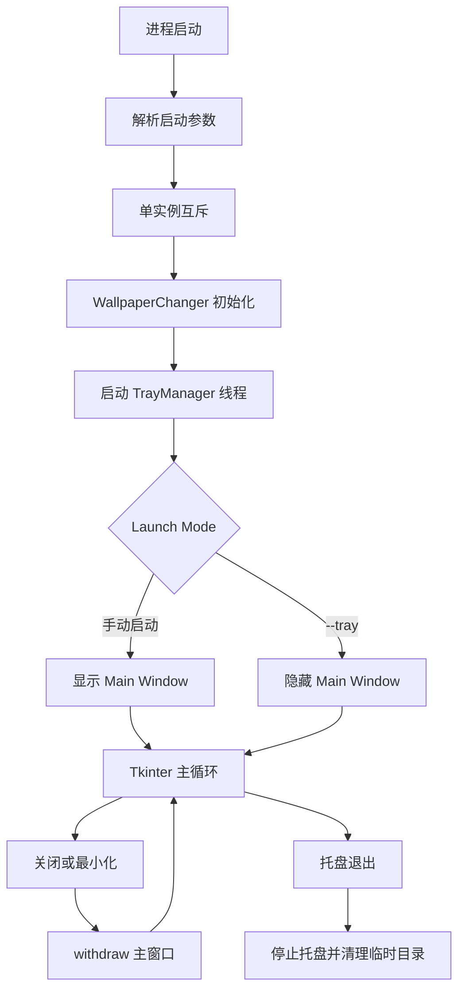
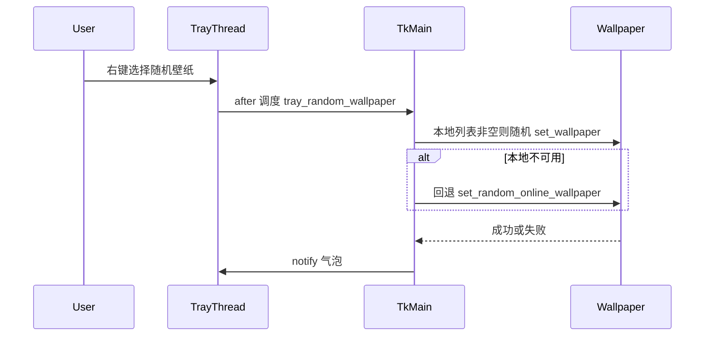

# 系统托盘后台运行

Feature Name: system-tray
Updated: 2026-09-02

## Description

在现有单文件 Tkinter 桌面应用中增加 Windows 通知区域驻留。关闭与最小化均隐藏主窗口；托盘左键恢复界面，右键提供显示主界面、随机壁纸、退出。开机自启动写入 `--tray` 参数，启动后静默驻留。随机壁纸优先本地文件夹，本地不可用时回退到当前在线分类。

## Architecture

主线程继续承载 Tkinter 事件循环与现有 `WallpaperChanger` 逻辑。托盘图标由独立后台线程运行，所有 UI 与壁纸操作通过 `root.after(0, ...)` 切回主线程。



二次启动时，新进程检测到互斥锁已存在，向已运行实例发送 Restore 信号后自行退出。



## Components and Interfaces

### TrayManager

职责：创建、更新、停止托盘图标，转发用户操作到主线程。

| 方法 | 行为 |
|------|------|
| `start()` | 在 daemon 线程中运行托盘循环 |
| `stop()` | 移除图标并结束托盘线程 |
| `update_icon(image)` | 用当前窗口图标刷新托盘图像 |
| `notify(title, message)` | 显示气泡通知 |
| `restore_window()` | `deiconify` + `lift` + `focus_force` |

菜单项：

- 显示主界面 → `restore_window`
- 随机壁纸 → `tray_set_random_wallpaper`
- 退出 → `quit_app`

左键单击与「显示主界面」共用 `restore_window`。

依赖选型：新增 `pystray`。项目已使用 Pillow，`pystray` 可直接消费 `PIL.Image`，避免手写 `Shell_NotifyIcon`。托盘线程与 Tk 线程隔离，禁止在托盘回调里直接操作 Tk 控件。

### WindowLifecycle

职责：把关闭、最小化改成隐藏到托盘；把真正退出收敛到 `quit_app`。

| 事件 | 处理 |
|------|------|
| `WM_DELETE_WINDOW` | `root.withdraw()` |
| `<Unmap>` 且 `state == iconic` | `root.withdraw()` |
| 托盘「退出」 | `quit_app()` |

`quit_app()` 顺序：停止托盘 → 调用现有 `_cleanup_temp` → `root.destroy()`。

托盘创建失败时：不绑定关闭隐藏，关闭按钮保持结束进程，并 `messagebox.showwarning`。

### TrayRandomWallpaper

职责：托盘「随机壁纸」的来源选择与并发保护。

```text
IF get_wallpapers() 非空
    随机选一张本地路径，调用 set_wallpaper
ELSE
    复用 set_random_online_wallpaper 的取图与设置路径
```

使用 `self._tray_random_busy` 布尔标志：进入时为 True，结束时清 False；为 True 时直接返回。

失败时调用 `TrayManager.notify("AIwallpaper", 失败原因)`，主窗口隐藏时也要能收到反馈。

### AutostartLaunchMode

职责：区分手动启动与开机自启动。

现有 `set_autostart(True)` 把注册表 Run 值写成可执行路径。改为：

```text
"<exe 或脚本路径>" --tray
```

`main()` 解析 `sys.argv`：存在 `--tray` 则初始化完成后保持 `withdraw`；否则 `deiconify`。

二次启动：保留现有 Mutex。补充命名互斥之外的窗口激活：已运行实例在初始化时注册一个 `HWND` 便于 `ShowWindow`，或使用 `ctypes` 查找窗口标题 `AIwallpaper` 后 `SetForegroundWindow`。新进程在 `GetLastError == 183` 时执行激活并退出。

### IconSync

`_apply_icon` 成功后，把同一张 `PIL.Image` 交给 `TrayManager.update_icon`。文件缺失时回退 `resource_path("1.ico")`，再回退内置纯色默认图，保证托盘始终有图像。

## Data Models

配置仍写入现有 `config.json`，本功能不新增持久字段。运行时状态：

| 字段 | 类型 | 含义 |
|------|------|------|
| `launch_minimized` | bool | 本次是否 `--tray` 启动 |
| `_tray_random_busy` | bool | 托盘随机壁纸进行中 |
| `tray_icon` | pystray.Icon 或 None | 托盘实例 |
| `current_icon_image` | PIL.Image 或 None | 供托盘使用的当前图标 |

启动参数：

| 参数 | 含义 |
|------|------|
| `--tray` | 初始化后隐藏主窗口，仅显示托盘 |

## Correctness Properties

- 同一时刻只存在一个托盘图标；`start()` 重复调用被忽略
- 所有 Tk 控件读写只发生在主线程
- 隐藏主窗口不停止 `update_clock` 与 `weather_loop`
- `quit_app` 只从托盘「退出」进入；关闭按钮不结束进程
- 托盘随机壁纸在 `_tray_random_busy` 为 True 时不启动第二次下载或设置
- 开机自启动路径始终带 `--tray`；手动关闭自启动时删除该注册表值

## Error Handling

| 场景 | 处理 |
|------|------|
| `pystray` 导入或创建失败 | 主窗口保持可见，提示托盘不可用，关闭即退出 |
| 托盘图标文件损坏 | 使用默认图标，不中断启动 |
| 本地与在线随机壁纸均失败 | 气泡通知失败原因，清除 busy 标志 |
| 在线下载超时 | 沿用现有 20 秒超时，失败走气泡通知 |
| 二次启动找不到已有窗口 | 新进程提示「已在运行」后退出，行为与现有互斥提示一致 |
| `quit_app` 时托盘线程未退出 | 设置 timeout 后仍 `root.destroy()`，避免卡死 |

## Test Strategy

手工验收（Windows 桌面）：

1. 手动启动：主窗口与托盘同时出现
2. 点关闭：窗口消失，托盘仍在，天气与时钟线程仍运行
3. 点最小化：效果与关闭相同
4. 左键托盘：主窗口回到前台
5. 右键「显示主界面」：同上
6. 选择本地文件夹后托盘「随机壁纸」：桌面变为本地图片
7. 清空或未选文件夹后托盘「随机壁纸」：走在线分类
8. 连续快速点击「随机壁纸」：仅第一次生效
9. 开启开机自启动后查看注册表命令含 `--tray`；用该命令启动时只出现托盘
10. 设置自定义图标后托盘图像同步变化
11. 托盘「退出」后进程结束，临时目录被清理
12. 程序已运行时再开一次：已有窗口被激活，新进程退出

自动化（可在后续拆出）：对来源选择与 busy 标志做纯函数级单测，不依赖真实托盘。

## References

[^1]: (Filename#L36) - 单实例互斥 `check_single_instance` (当前工作区 `/AIwallpaper.py`)
[^2]: (Filename#L1007) - 现有在线随机壁纸 `set_random_online_wallpaper` (当前工作区 `/AIwallpaper.py`)
[^3]: (Filename#L1516) - 开机自启动注册表写入 `set_autostart` (当前工作区 `/AIwallpaper.py`)
[^4]: (Filename#L1685) - 本地设置壁纸 `set_wallpaper` (当前工作区 `/AIwallpaper.py`)
[^5]: (Filename#L1819) - 本地壁纸枚举 `get_wallpapers` (当前工作区 `/AIwallpaper.py`)
